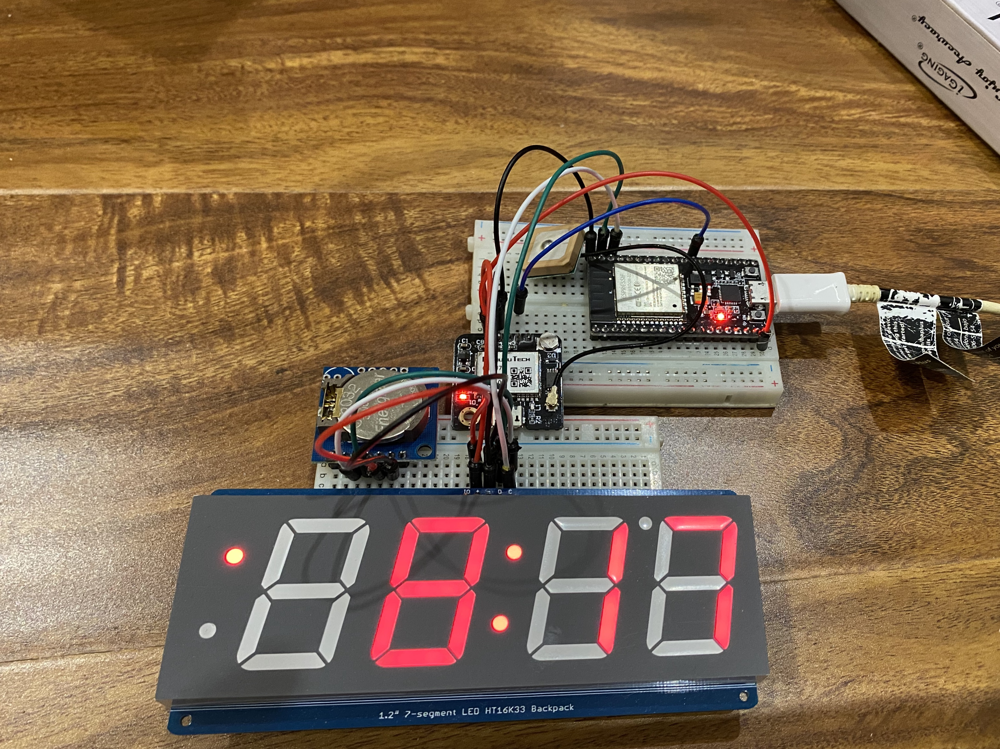

# GPS-Clock
Using an ESP-32, TinyRTC, 7 segment display, and a gps module: Make a clock that sets itself.

Note: This code is no-way the most efficient/graceful. This is a personal project.

# Inspiration
This project came out of the pure frustration I have/had with a night stand alarm clock bought from some un-named store.
The clock was strictly used for time keeping purposes, no alarm function. To my complete disbelief, the clock would drift +/- 5 minutes every month. With no explanation, that I know of.
Jokingly, the new meetup group, Null Space Labs, I was beginning to become a member of at the time, and am still to this day, said I should make my own.
And that's what I set out to do.

If you are interestd in checking us them out, I highly recommend it.

Website: https://032.la/

Meetup: https://www.meetup.com/nullspacelabs/

# Library's

* Wire.h 

* Adafruit_GFX.h 			Version: 1.7.4 		From: https://github.com/adafruit/Adafruit-GFX-Library

* RTClib.h					Version: 1.3.3		From: https://github.com/adafruit/RTClib

* Adafruit_LEDBackpack.h 	Version: 1.1.6		From: https://github.com/adafruit/Adafruit_LED_Backpack

* TinyGPS++.h				Version: 1.0.2		From: https://github.com/mikalhart/TinyGPSPlus

* TimeLib.h					Version: 1.6.0 

* Timezone.h 				Version: 1.2.4		From: https://github.com/JChristensen/Timezone

# Parts List

* [ESP-32](https://www.amazon.com/gp/product/B0718T232Z/ref=ppx_yo_dt_b_asin_title_o02_s00?ie=UTF8&psc=1)

* [GPS NEO_6M](https://www.amazon.com/gp/product/B07P8YMVNT/ref=ppx_yo_dt_b_asin_title_o06_s00?ie=UTF8&psc=1)

* [Adafruit 1.2" 4-Digit 7-Segment Display](https://www.adafruit.com/product/1270)

* [TinyRTC](https://www.amazon.com/DS1307-Precision-Compatible-Atomic-Market/dp/B00TMI1ZSC)

# Pictures



# Discoveries

* Delay function does not play nice with this program, use millis() instead.

```
delay(1000);
```

* gps encode inside the millis() section works great, it reads gps data for frequently, and accuratly.

```
unsigned long time_now = 0;
time_now = millis();
while(millis() < time_now + 1000){
	//wait approx.  1 second = (1000ms)
	char c = Serial2.read();
	gps.encode(c);
}
```

# Improvements

* Addition of tp4056 with an 18650 battery and switch.

* Custom make a PCB to mount everything in a smaller form factor.

